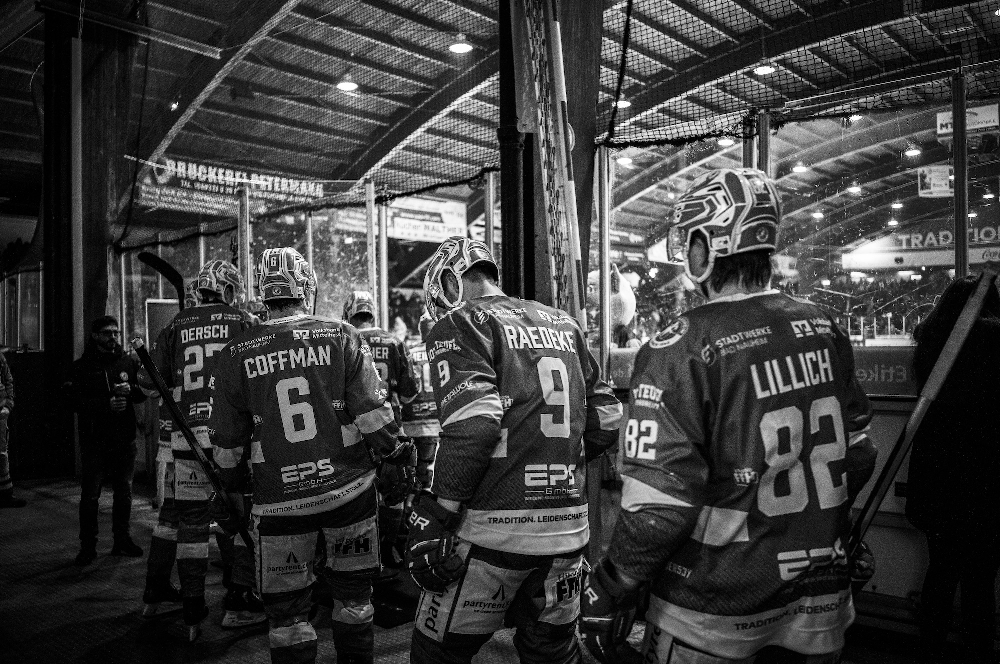

# Text recognition using AWS Rekognition 



Some simple lines from `ecbn.txt`:

```
6,Tim Coffman,EC Bad Nauheim,Player
27,Alexander Dersch,EC Bad Nauheim,Player
9,Brent Raedeke,EC Bad Nauheim,Player
82,Markus Lillich,EC Bad Nauheim,Player
```

Using poetry, you can simply run the sample application like so:
`poetry run python rekognition.py demo.jpg ecbn.txt`

```
Detected text: ['TRAD', '6', 'DERSCH', 'Volksbank', 'Mittelhess', 'BAD STADTWERKE NAUHEIM', 'RAEDEKE', '27', 'STADTWERKE', 'COFFMAN', 'BAD NAUHEM', '6', '9', 'LILLICH', '82', 'EPS', 'EPS', 'TRADITION. LEIDENSCHAFT.STOLZ', '82', 'FFH', 'par']
Matched player names and numbers:
- Code: bn6, Number: 6, Name: Tim Coffman, Team: EC Bad Nauheim, Role: Player
- Code: bn27, Number: 27, Name: Alexander Dersch, Team: EC Bad Nauheim, Role: Player
- Code: bn9, Number: 9, Name: Brent Raedeke, Team: EC Bad Nauheim, Role: Player
- Code: bn82, Number: 82, Name: Markus Lillich, Team: EC Bad Nauheim, Role: Player
```